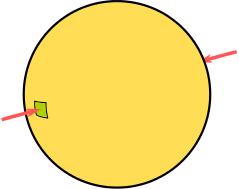
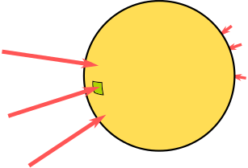

Pressure is technically defined as force per unit area and represented
with an SI unit, the pascal.

$$p=\frac{F}{A}$$

Where $p$ is the pressure, and $F$ is the *magnitude* of force applied
normal to the area $A$. This means pressure is a scalar quantity. 

But what exactly does pressure mean? And why is it useful? In the
figure below 4 different surfaces are drawn each with the same
pressure.

Like the diagram on the far right it's often beneficial to think of
pressure as a *scalar* value defined at at a point.

You may wonder why pressure is a *scalar*, why it has no concept of
direction. Direction is certainly important when considering forces
(imagine if gravity wasn't pulling you *down* towards the earth).

so why isn't it important when we talk about pressure? The reason is
that the force is understood to act normal to the surface of the
object on which the pressure acts.

## Example: Ball in a bath tub

Imagine a tub of liquid (say water). Now just
suppose that at every *point* in the tub the pressure is $10$ Pa. What
would happen if we put say a tennis ball right in the middle. In other
words what would be the *net* force on the ball? 

The figure above shows a small *patch* of area on the surface of the
ball lets call it $A_p$. Now we know the pressure is $10$ pa, the
force must be $10*A_p$ and its direction is normal to the surface.
This means the force points straight towards the center of the ball.

So what is the total force acting on the ball? If it's not imediately
obvious think about it? 

Its zero right? This is because for every small patch that causes a
force toward the ball's center there is *always* one on the other side
of the ball that directly cancels it. So nothing would happen.

## Example 2: A pressure change

Of course a real ball is unlikely to just sit in the middle of the
tub. It will either sink or float and we will get to *why* in the next
module. 

For now lets just make a small modification to the bath tub example.
what would happen if the pressure on the left of the ball was greater
than the pressure on the right? For some help look at the picture
below

The balls surface hasn't changed so all the forces still all point to
the centre of the ball. But what has changed is that forces on the
left hand side are all larger than the forces on the right. If we
added up all the forces we would find that the net force points to the
right. The ball would start moving that way.

Here we can see that if we know what the pressure is at every point in
a fluid we can predict what forces will act on a submerged object.
Also we can see that a change in pressure also known as a pressure
gradient or a pressure differential can cause motion. For example this
is why water flows in a garden hose.

<!-- vim: set ft=pdc: -->
